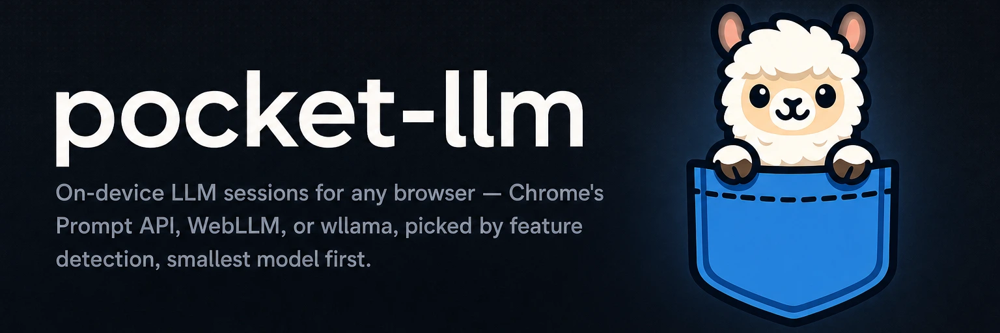

# 

**On-device LLM sessions for any browser.** pocket-llm feature-detects the fastest engine the browser can run, from Chrome's built-in Prompt API to WebLLM on WebGPU to wllama on CPU WASM, and defaults to the smallest model each engine supports.

[](https://github.com/yasyf/pocket-llm/actions/workflows/ci.yml)
[](https://www.npmjs.com/package/pocket-llm)
[](https://github.com/yasyf/pocket-llm/blob/main/LICENSE)

## Get started

```bash
npm install pocket-llm
```

```ts
import { createSession, detect } from "pocket-llm"

const found = await detect()
// { lane: "webllm", availability: "needs-download",
//   model: "SmolLM2-135M-Instruct-q0f16-MLC", downloadBytes: 269030016 }

const session = await createSession({
  system: "You review shell commands and answer with a verdict.",
  responseSchema: {
    type: "object",
    properties: { verdict: { type: "string", enum: ["allow", "block"] } },
    required: ["verdict"],
  },
  onProgress: (p) => console.log(p.loaded, p.total),
})

const result = await session.prompt("Verdict for: rm -rf /")
// { verdict: "block" }

await session.destroy()
```

`detect()` never downloads anything. It names the lane, the model, and the byte cost, so your UI can ask before `createSession()` fetches weights.

Driving with an agent? Paste this:

```text
Install pocket-llm (npm install pocket-llm) and wire it into my page: call detect(),
offer the download at the reported size, then createSession() with my JSON schema
and render session.prompt() results. Repo: https://github.com/yasyf/pocket-llm
```

---

## Use cases

### Use the model the browser already ships

Chrome 138+ carries Gemini Nano behind the stable Prompt API. When `LanguageModel` is present and usable, sessions ride it directly: no download beyond what Chrome manages itself, and structured output is enforced with the API's own `responseConstraint`.

### Use the GPU when the browser has one to offer

A browser without a built-in model but with WebGPU gets WebLLM, defaulting to the smallest chat model in its catalog, SmolLM2-135M-Instruct at ~269MB, fetched once and cached. Structured output rides `response_format` JSON schema via XGrammar.

### Fall back to CPU WASM everywhere else

A browser with neither the Prompt API nor WebGPU, which today means Safari and Firefox, gets wllama: llama.cpp compiled to single-threaded WASM, defaulting to SmolLM2-135M-Instruct GGUF Q4_K_M at ~105MB. It needs no COOP/COEP headers, so static hosts like GitHub Pages qualify. llama.cpp's grammar sampling keeps output on schema.

## API

### `detect(options?)`

Returns `{ lane, availability, model, downloadBytes }` for the first eligible lane, in order `prompt-api` → `webllm` → `wllama` (or the order you pass in `options.lanes`). `availability` is `"ready"` or `"needs-download"`; the WebLLM and wllama lanes always report `"needs-download"`, since checking their caches would mean importing the engine, and `detect()` imports and downloads nothing.

### `createSession(options?)`

Downloads happen here, and only here. A lane whose creation throws falls through to the next eligible lane.

| Option | Type | What it does |
|---|---|---|
| `system` | `string` | System prompt for the session. |
| `responseSchema` | `JsonSchema` | Constrains output; `prompt()` then returns the parsed object. |
| `onProgress` | `({loaded, total}) => void` | Download progress. Prompt API and WebLLM report fractions; wllama reports bytes. `total` is `null` when unknown. |
| `models` | `{webllm?, wllama?}` | Per-lane model overrides (`webllm` takes a catalog id; `wllama` takes `{repo, file?, quant?}` on the HF hub). The Prompt API model is browser-managed. |
| `assets` | `{wllama?: {default: url}}` | Wasm asset URLs for wllama, required when that lane is picked. |
| `lanes` | `Lane[]` | Constrain or reorder the chain, e.g. `["wllama"]` to force CPU. |

The session is `{ prompt(text), destroy() }`. `prompt()` resolves to a schema-parsed object when `responseSchema` was set, a plain string otherwise; `destroy()` releases the engine and any worker it owns.

### Structured output

Each lane enforces the schema natively: `responseConstraint` on the Prompt API, `response_format` JSON schema (XGrammar) on WebLLM, and a llama.cpp GBNF grammar on wllama, converted by the exported `jsonSchemaToGbnf()`. The converter covers `object`/`properties`/`required`, `string`, `number`, `integer`, `boolean`, `null`, `enum`, `const`, and `array`; anything outside that subset (`anyOf`, `$ref`, `patternProperties`, ...) throws `PocketLlmError` rather than emitting a wrong grammar.

### Hosting wllama's wasm

The library hardcodes no CDN. Host `@wllama/wllama`'s wasm yourself and pass its URL as `assets: { wllama: { default: "<your-static-path>/wllama.wasm" } }`. The lane runs single-threaded (`n_threads: 1`), which is what makes the no-COOP/COEP deployment work.

Status: 0.1.x. The three lanes are implemented with a stubbed-engine test suite; real-model manual QA is ongoing.

Licensed under [PolyForm-Noncommercial-1.0.0](LICENSE).
